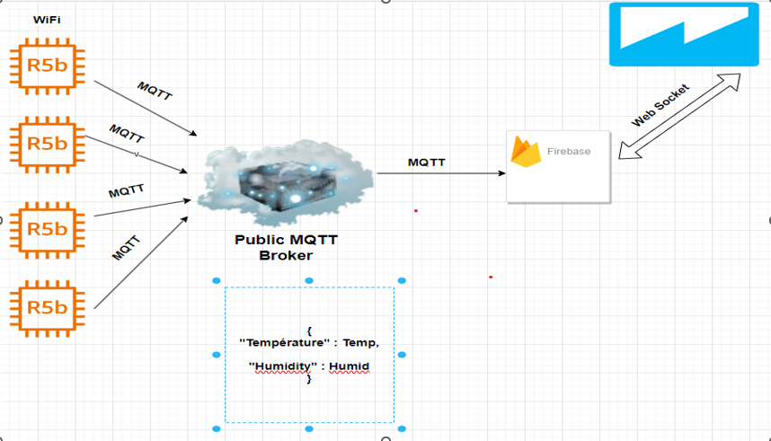

# Projet-IoT

Le projet consiste à mettre en place une tour hydroponique dans une logique d'economie d'energie. Il fallait mettre en oeuvre une tour qui enverra ses données dans une base de donnée logée dans le cloud.
Ces données seront ensuite visualiser sur une application web ou android.
Il a deux partie principale à savoir la partie materielle et la partie logicielle.

# Partie materielle
  - un capteur DHT22 pour mesurer la temperature et l'humidité
  - une pompe à eau pour arroser les plantes
  - un tuyau pour faire circuler l'eau
  - un microcontrôlleur: ESP32
  - des fils pour connecter les composants electroniques
Ceux sont nos choix materiels pour mettre en oeuvre la tour hydroponique.

# Partie logicielle

Pour mettre en place la partie logicielle, nous avons mené des choix des outils à utiliser.
Pour la visualisation des données, nous avons opté pour une application web. les points suivants detaillent nos choix.

   # Application web

   - HTML, CSS et Javascript pour la mise en oeuvre du site
   - Node.js pour servir de serveur
   - Expressjs pour la gestion des routes
   - Emailjs pour l'envoi de mail

   # Cloud

   - Firebase: nous avons utilisé sa fonctionnalité Database realtime pour l'envoi des donnée en temps réel

   # Logicielle pour la partie materielle

   - Serveur broker public emqx
   - Mqttx pour faciliter l'abonnement et la publication sur le serveur.

# Architecture

